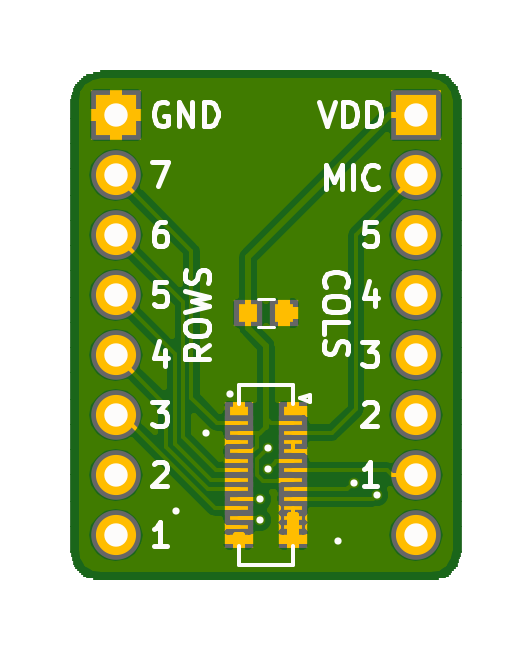
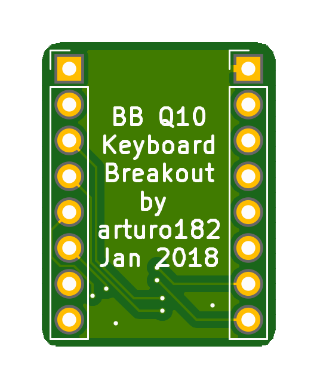
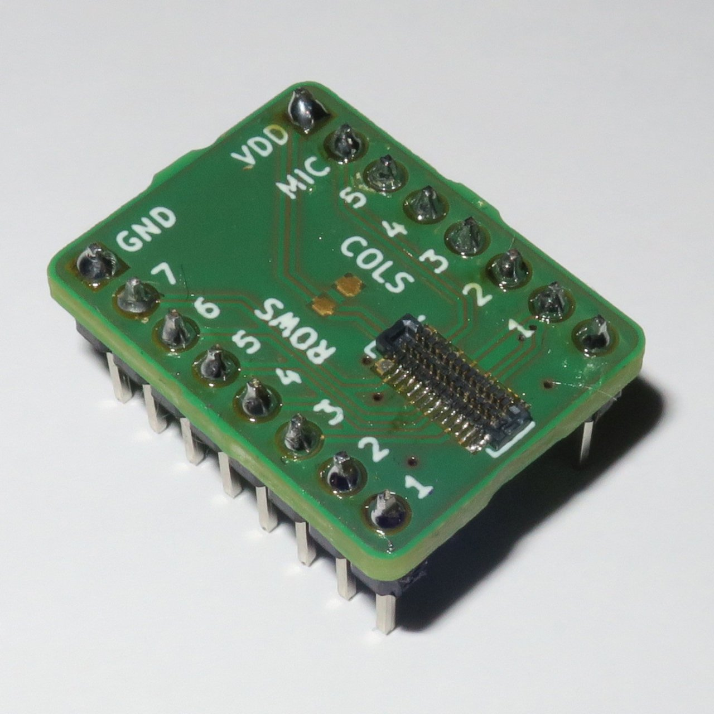

# Blackberry Q10 Keyboard breakout board

This is a very simple board breaking out the Q10 keyboard connector, but it is enough to read all the keys, as well as the MIC pin and provide backlight.

 

 

For more details about the Q10 keyboard see:

https://github.com/arturo182/BBQ10KBD